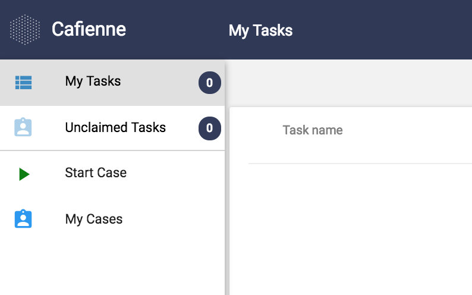

## My Cases and Tasks
Cafienne UI comprises an user interface for MyTasks and My Cases. A case worker needs to be logged in to be able to use this user interface. In this UI a Case worker is given an overview of Tasks assigned to him or her. Next, there is a list of unclaimed Tasks that are assigned to a Role he or she fulfills; these tasks are available but not yet activated. Furthermore, there is a list of cases assigned to the user or the Case Team she or he participates in.



Also, we made it possible for a Case Worker to start a Case. The Start Case allows the user to sent a message to the Case Engine. This message starts the lifecycle of the Case, first of all by setting the state of the Case to Active.

## Task User Interfaces
We also added to Cafienne-demo “a method” that allows you to generate a Human Task interface, based on a JSON-file. This helps a lot in communication with business users or Case Workers. Next to validating the model, they can now  easily validate the way the work is organized by testing this by using “simple” UI with which they can complete their tasks. Completing a task will trigger the Case Engine, which will evaluate the state of the Case.

For instance, the JSON for starting the business application Hello World looks like:

```sh
{
  "schema":  {
    "title": "Greeting",
    "type": "object",
      "required": [
      "Greeting"
    ],
    "properties": {
      "Greeting": {
      "title": "Your greeting to the World",
      "type": "object",
        "properties": {
           "Message": {
              "type": "string",
              "title": "Your message"
            },
            "To": { 
              "type": "string",
              "title": "To whom?"
              },
            "From": {
              "type": "string",
              "title": "From",
              "default": "$CURRENT_USER"
              }
            }
          }
       }
     }
   }
```
