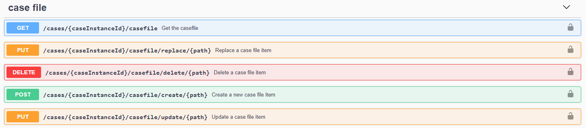

## Case File
Cafienne has a somewhat opiniated implementation of the CMMN Case File concept. It interprets JSON documents and applies name based mappings to feed the Case File.
Both properties and children of a Case File item can be put in the same JSON document, in an attempt to provide a developer friendly format.

## Retrieving the Case File

The Case File holds the data contained in the case instance. You can retrieve it through the below **GET** method. It will return a JSON structure with all data of the Case File. 

## Changing the Case File

There are multiple ways to change the Case File

### Completing a Task
When a Task completes, regardless of the type of Task, its Output parameters will be mapped back into the Case File according to the mappings specified in the Case Definition.

This is how most applications use Cafienne currently.

### Directly changing the Case File

However, it is also possible to directly manipulate the Case File structure. Nothing in the CMMN specification prevents you from doing that, and the same goes for Cafienne.

