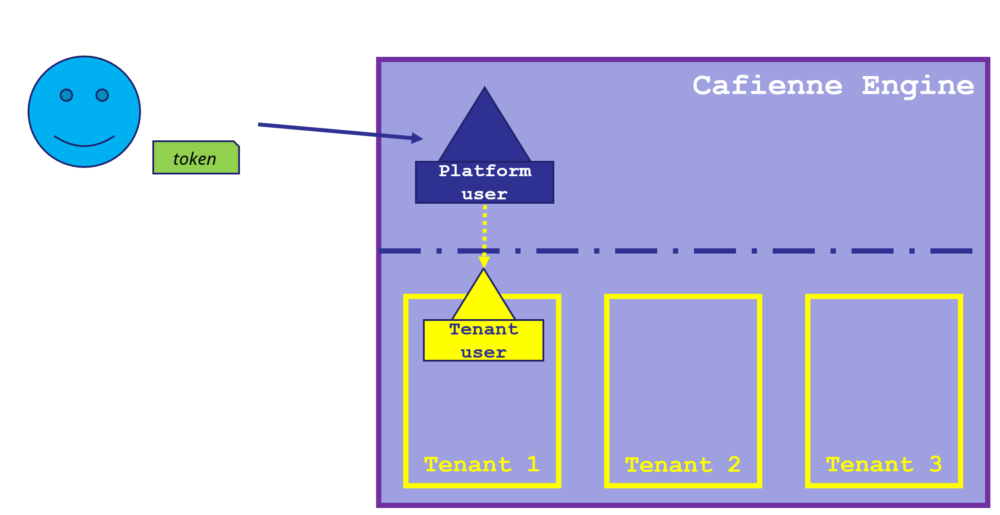

## Cafienne uses OpenID Connect
Cafienne in itself does not implement any form of authentication. Instead, the engine relies on the [OpenID Connect](https://en.wikipedia.org/wiki/OpenID_Connect) protocol.
Users can authenticate to Cafienne with [JSON Web Tokens](https://jwt.io/) (JWT) provided by an external Identity Provider.

### IDP Configuration
The provider must be configured in the `local.conf` file of the Cafienne Engine.

### Example in [`getting-started`](https://github.com/cafienne/getting-started)
The Cafienne demo environment in [`getting-started`](https://github.com/cafienne/getting-started) comes with a default Docker image of the open source [Dex Identity Provider](https://github.com/dexidp/dex).
This image is preloaded with a few demo users, and this list can be extended manually in the `/src/idp-conf/dex.yaml` file.

## Platform Users and Tenant Users
Every user that is able to get a JWT token from the Identity Provider can access the Cafienne Engine.
The Cafienne Engine uses these tokens to identify it's internal platform users and tenant users.

### Mandatory JWT Token Claims
The JWT token must contain a `sub` claim. This claim is used to uniquely identify users in the Cafienne Engine. The value of the claim is passed one on one, i.e., without any translation.
Some Identity Providers, such as Dex, fill the claim in an encoded manner, e.g. `CgVhZG1pbhIFbG9jYWw`.
This can help in a security context where personal user information may not end up in the case engine's storage.  

### Platform User
The token must contain the `sub` claim. This claim is used to create a Platform User. This is nothing more than a simple conversion of the token into an internal structure.

To be more precise, the Platform User _does not have any rights_ within the Cafienne Engine. 

In essence a `Platform User` has only two properties:
- `user id` which is the value of the `sub` claim from the `JWT` token
- `tenants` which holds the list of tenants in which the platform user has been registered. This list can be empty, meaning that the user has no access to any tenant in the platform. This is typically the case for platform owners, see the [Cafienne Authorization Overview](cafienneAuthorization.md).

### Tenant User
For all the tenants that the user has been registered a `Tenant User` structure is created.
This structure holds the following properties:
- `user id` with the same value as the platform user and the `sub` claim from the token.
- `roles` which is a set of roles that the user has within this specific tenant. This set may be empty. Also, the same user may have different roles in different tenants, e.g. a user working for a Supplier will be "Employee" in the supplier tenant, and may be "Supplier Representative" in a tenant that is a customer of the supplier.
- `name` Name is an optional property
- `email` Email is an optional property
The optional properties are hardly used.

When a user sends a request to the Cafienne Engine this is typically directed into a specific tenant. E.g., a case must always be started in a specific tenant.
Some queries, e.g. `GetMyCases` or `GetAllTasks` without a tenant filter set will be executed across all tenants that the user has been registered in.

