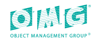

Cafienne assumes you are familiar with the [**Case Management and Model Notation (CMMN)**](https://www.omg.org/spec/CMMN/1.1).

If, however, you are new to CMMN: here you can find a little bit more info about it. If it makes you curious: don't hesistate to contact us and we're happy to help you further.

## CMMN Background
First some dry facts.

  

The Case Management and Model Notation was introduced in May 2014 by the [Object Management Group](https://www.omg.org).

Cafienne implements **CMMN 1.1**, the version that was published in December 2016.

The specification intends to provide a language to describe the lifecycle of a case in a graphical manner.

Ehhh ... a case?

### Classical Dossier
There are many associations to the word _case_. If you google the word, you may quickly end up in a medical definition, or a legal one. And all of these are valid definitions.

Perhaps, as an alternative to the heavily associated word _case_ you can also consider it a _dossier_.

- A dossier holding patient treatment information
- A dossier holding your passport renewal application
- A dossier holding all customer interactions on a service request

Many examples can be thought of.

In a classical environment without IT automation, all of these dossiers share something in common: they hold documents.

Each time new information is received, this information will be added to the dossier. Probably it is tied together with a paperclip.

The proceeding within the case is not always made explicit. You can perhaps reconstruct it by reading all the documents in order. Alternatively a small summary card can be available on the top of the file.

Further structuring of the case is typically based on company policy or best practice, and not enforced by the system.

In contrast to this, CMMN provides a higher level graphical language with explicit semantics to help describe the various examples. 

### CMMN gives structure

The reason that we as Cafienne are so excited about the CMMN language, is that it has a very intuitive and elegant model to put structure to dossiers and cases and use that as the basis for automation.

A case expressed in CMMN will consist of three elements

- Case File
- Case Plan
- Case Team

#### Case File
The Case File holds pretty much what it says: all data relevant to the case.

#### Case Plan
The Case Plan expresses the proceedings within the case, also called the lifecycle of the case.

The plan entails the various tasks that need to be done by people working on the case, milestones that can be achieved, or the various phases that a case can go through.
Also time is an important aspect that tends to influence plans.

The nice thing of the graphical nature of CMMN is that the plan can be depicted through boxes and lines describing the dependencies between the boxes. This makes it very intuitive to understand whether the model implements your specific use case.

#### Case Team
A case also has a team of people working on it, potentially in various roles. E.g., the treatment case mentioned above probably has a doctor in the role of Treating Physician, and the person under treatment has the role of Patient.

Note that every case has its own team. If the doctor becomes ill and gets a treatment, then in his case he is probably not fulfilling the role of Treating Physician, but rather the role of Patient.

