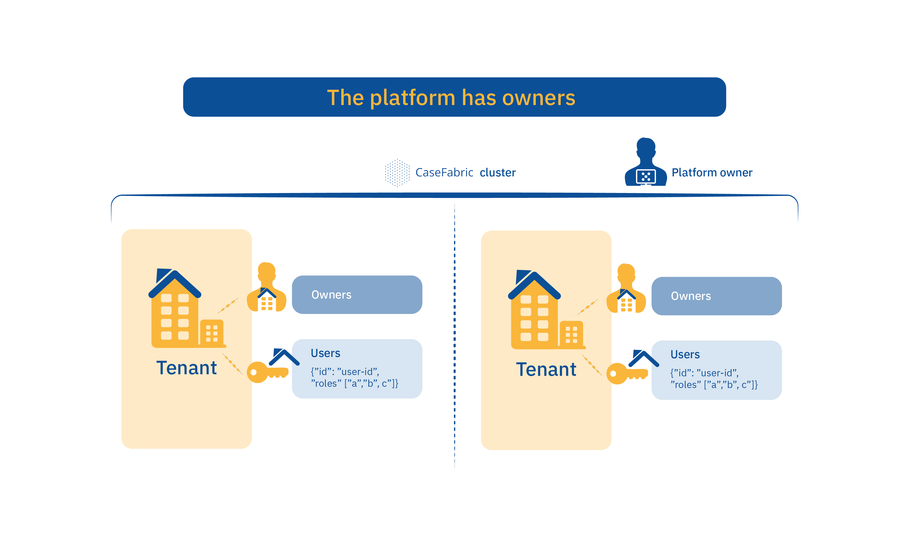
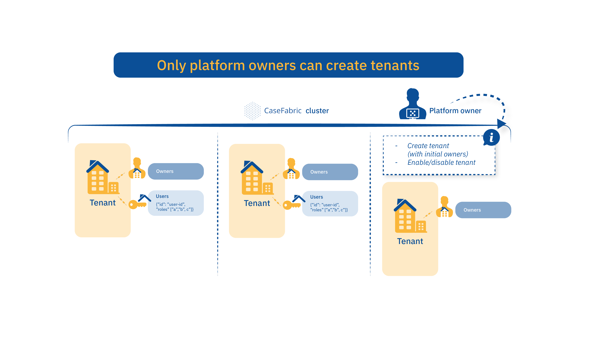
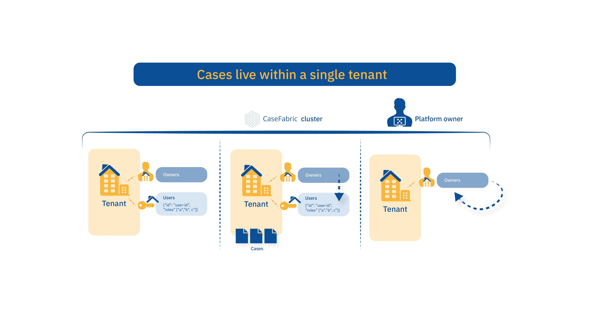
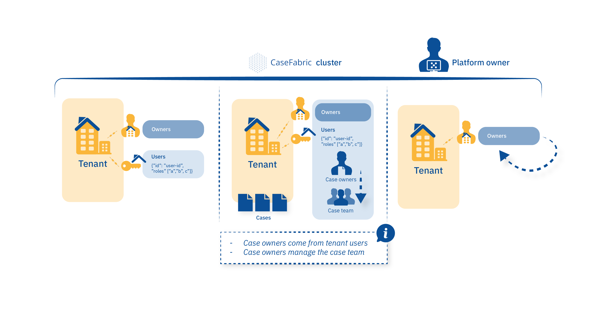

## Introduction
This page gives a pictorial explanation of the Cafienne multitenancy and authorization architecture.

For a detailed description please read [Cafienne Authorization](engineAuthorization)

  

-------------------------------------------------------------------------------

  

-------------------------------------------------------------------------------

  

-------------------------------------------------------------------------------

  

-------------------------------------------------------------------------------

  

-------------------------------------------------------------------------------

  

-------------------------------------------------------------------------------

  

-------------------------------------------------------------------------------

  

-------------------------------------------------------------------------------

  

