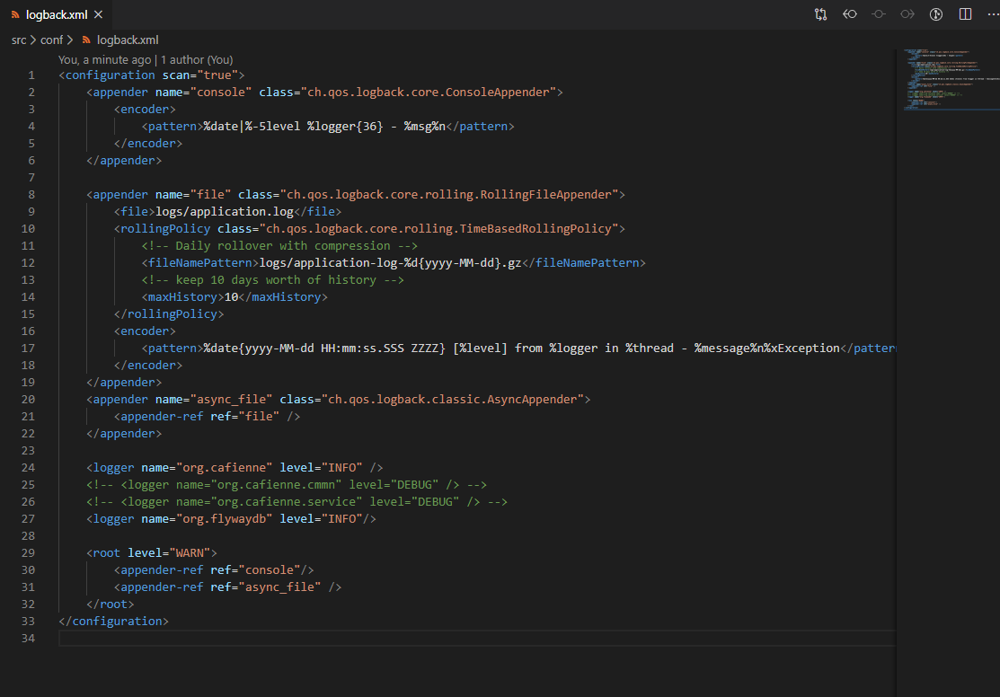
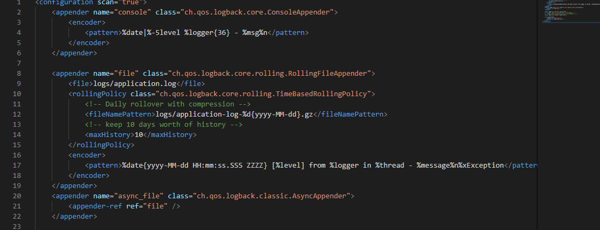
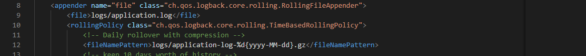

## Introduction
Cafienne has multiple logging configuration options. On the one hand they are developer oriented, on the other hand they are operational.
For the operational logging Cafienne uses standard [Logback](http://logback.qos.ch/) libraries.
Developers can also use this logging, but since it can be somewhat overwhelming, the case engine also has support for case instance specific [**debugging**](ideDebugCase).

## Configuration of Logback
Inside the docker setup of the Cafienne engine, there is a folder `./src/conf`.
This directory holds 2 files, `local.conf` and `logback.xml`.

This document will not describe the full options that are possible with Logback. But a couple of things are important to mention.
Here is screenshot of the contents for ease of reference while reading this page.

  

### Appenders
First of all, the default logback contains two so-called appenders. These indicate where log messages should end up.

#### `console`
One appender is simple: directly to the console. This logging is visible when you run the docker-compose up.
It holds a simple pattern that prints timestamp information in front of each message, along with the log level (`ERROR`, `WARN`, `INFO`, `DEBUG`, etc.).

  

#### `file`
The other appender logs messages into the file system.
There is actually a third appender, telling to log and write messages in an asynchronous manner in order to offload the main process of execution of the program.

The file logging is configured to start logging in a fresh file every day. And also to store the files not more than 10 days.

There are too many options to describe here. Please checkout the Logback community to learn more about it.

  

One particular option must be mentioned, though. The file name is rooted in the `logs` directory. This directory by default resides _outside_ of the docker container.

### Loggers
Below the appenders, we find a couple of loggers. Loggers can be configured at very detailed depth. They indicate for which part of the code which type of messages are logged.

In the example above, it tells that at `root` level, i.e. across all code, only `WARN` and `ERROR` messages must be logged. The individual loggers of `org.cafienne` and `org.flywaydb` tell that their `INFO` messages must also be logged.

Please note that the `root` also tells which appenders to use.

  

### Changing the settings
The top element of the `logback.xml` contains a special attribute `scan="true"`. This tells `Logback` to refresh the contents of the logback.xml file once every minute, and perform a live reload.

That means, you can change the contents of the logback.xml, and within a minute, the Cafienne Engine will pick up your changes and act accordingly, without needing to restart the engine.
