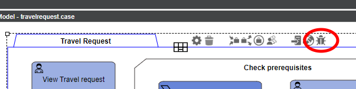
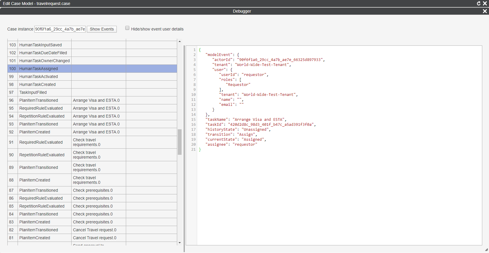
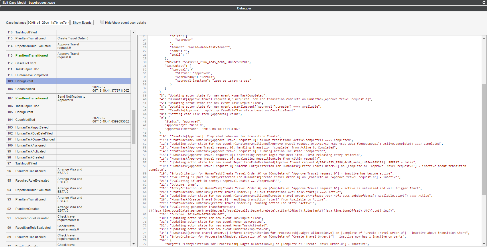

## Introduction
The Cafienne Engine comes with an IDE in which you can design [`CMMN`](https://omg.org/spec/CMMN) based case models.

The cycle of designing, running and debugging a complex model is not straightforward.
Cafienne recommends to use all the well known software development tools that are available for this.

In addition, Cafienne Engine comes with a few special options to help in the area of debugging case models.

This page explains how to setup these features.

  

## Case Engine events
Each time a case is started and run inside the Cafienne Engine, the commands that are sent to the case (e.g., start a case, complete a task) result in changes. These changes are stored as events in the underlying database.

Inside the Cafienne IDE, a debugger is available that can render these events. You can open it through the right-most halo of the case plan model.

  

The debugger can render events of individual case instances.
When you copy paste the case instance id into the debugger, and press the `Show Events` button, the events will be retrieved from the engine and rendered in the screen.

  

Or ... not?!

  

## Debugger Route
In order to show events in the debugger, the Case Engine must open up the debug API.
The default configuration that comes with `getting-started` has this option enabled.
It can be changed inside the `./src/local.conf` settings.

  

## More logging
The above screenshot of `local.conf` starts with a `debug=false` option.
This option determines whether cases will be started in `debug` mode by default.

If a case runs in `debug` mode it will generate additional logging information in a special type of event, called `DebugEvent`. Running the debugger from the IDE gives a lot of inside information from the engine.

  

