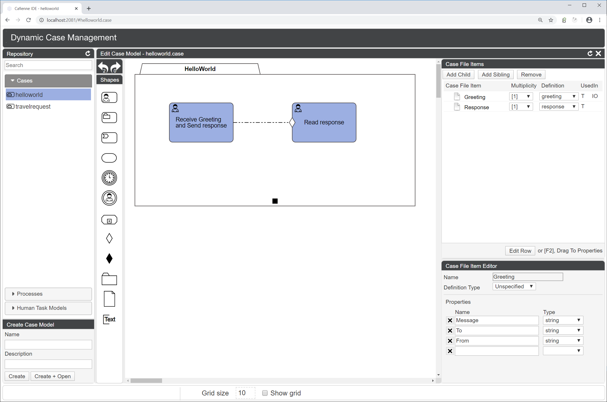

Yes, Cafienne comes with an Integrated Development Environment (IDE).

But perhaps we should say "Integratable Development Environment" instead. Bottomline, the Cafienne IDE is nothing more than a Node.js application that serves a HTML website through which you can read and write CMMN diagrams (case models).

There are no fancy tech features like source control integration, folder and hierarchy creation, file renaming, nor does it support fancy business analyst presentation modes.

It provides a means to quickly build, validate and deploy case models that fully integrates with your existing development and coding infrastructure. 

## Cafienne IDE fits into your development system

  

## What runs in your browser?

The Cafienne IDE contains a graphical designer for CMMN models.

  

But there is more to it.

## Repository
On the left hand of the system, we see the Repository Browser. Here you can see which cases are in the file system, and you can also create new cases.
Basically, the Repository Browser provides for a simple rendering of the list of artifacts that are inside the file system.
These artifacts entail:
- cases
- human tasks
- processes

Note that in the file system these are stored inside the designated `/repository` folder. The files in this folder can have one of the following extensions
**`.case`**, **`.dimensions`**, **`.humantask`**, **`.process`** and **`.cfid`**.

The HelloWorld diagram shown above, is stored in the repository as **`helloworld.case`** and **`helloworld.dimensions`**. The first file contains the actual semantics of the case model, whereas the second file contains the graphical representation. By doing this, the files can be tracked independently in your source control system, allowing you to distinguish semantic from graphical changes when reading history.

The **`.humantask`** and **`.process`** extensions are stored to enable reuse of tasks and processes across multiple cases. E.g., the **`Read Response`** task in above **`HelloWorld`** case can also be used inside the **`TravelRequest`** case model. 

The **`.cfid`** extension is used to store reusable Case File Item Definition documents. These can be reused when selecting the definition for an item in the case file, as can be seen on the right hand of the IDE.