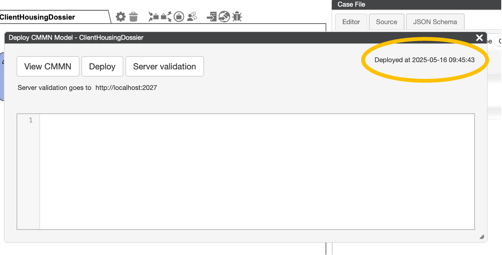
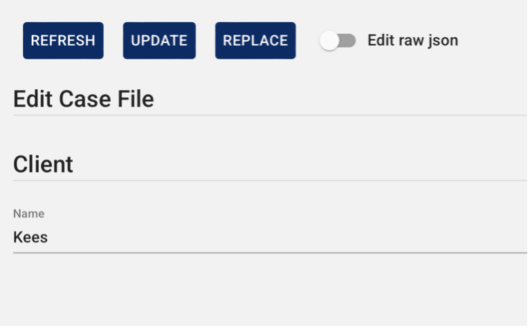

## Use Case Step
The first step will be for Lana to be able to start a dossier and enter client details.
Lana needs to first register the client, and his base data. All the following steps that will be made to solve the issue for the client will be linked to this. Next to that Lana will hand out initial tasks to co-workers that need to act. Since this case is specific to this client, and his privacy needs to be taken care of, the people that are allowed to work on this must have the right authorization to do this.

## Step 1: Create the case model

### Solution support step
We will now build the overall Case, which we can call the ‘ClientHousingDossier’ at the highest (non-detailed) level. We will set initial authorization levels by adding the team that is allowed to work on the case, so that Lana cannot make mistakes in this. We will build the case in such a way that in principle at this highest level, it can already be a functioning (running) model that can support Lana in her work. We will show this by deploying the model that has been built and run it via the CaseFabric test application.

Add a new case with the name: ‘client housing dossier’. Click the plus button on the top left to create a new case model.

Enter the name of the case. We will call it "ClientHousingDossier”. Note that the name cannot contain spaces.
If you tab to the next field, we can enter a description that explains briefly what the case is all about.
You also see that after pressing the tab button, a Type and a case team are suggested. We will come back to this later in the training.

When pressing the ok button, the screen will create the model and open it.
On the left of the screen, we see the “Repository” tab. This holds the list of elements that we are designing.

In the middle of the screen we see a big white canvas, this holds the Plan of the case.
The plan consists of items, such as tasks and milestones.

On the right we see the tab “Case File”, this is where we can model the information available within this case model.

## CaseFabric/CMMN explanation
***A case cannot exist without information. In CMMN the plan (case plan) and the data (case file) are related to the overall case.***

## Step 2: Configure the information model of the case - Case File.

### Solution support step
The case always has Client information. We can add a property by clicking the insert button and typing the name “Client”.

This property must have a type. When clicking the type of dropdown, a list of possible types shows up.
We can choose from simple properties, such as a number or a text. We can also choose “object” this enables to setup a more complex structure.

This is needed for the client, as a client has multiple fields, such as: name, perhaps email address, birth date, etc.

Note that when we first meet the client, we may not know more than a name or even the client refuses to give his real name.

## CaseFabric/CMMN explanation: CaseFile
***While iteratively building the overall case model, the data in the model will become more complex and the case file will complete. The case model holds this information during the collaboration in building the case with the client.***

 

## Step 3: Create a work plan

### What is a Shapebox?
In CMMN, the formal language, the Case has a CasePlan and a CaseFile. The CasePlan consists of PlanItems, and the CaseFile consists of CaseFileItems.

### Deeper explanation of the ShapeBox:

The box has multiple constructs that can be used in drawing the plan. On the top, we find the Plan Items “HUmanTask”, CaseTask, ProcessTask, Milestone, TimerEventListener, UserEventLIstener and Stage.

In the section under Stage we find EntryCriterion, ReactivateCriterion (CaseFabric specific extension to CMMN) and ExitCriterion. Criteria are mechisms that can be used to configure dependencies between plan items.

At the bottom we also find CasePLan, CaseFileItem and TextAnnotation. These are mainly helpful to explain the plan, rather than that they have a semantic impact.

### Solution support step
Let’s start creating the plan!
The first that is necessary when we start the housing search, is to enter some details about the client. For that, the Lana user needs to perform a task to Enter the Client details. In the middle of the screen on the big white canvas we can create the plan.
A plan consists of items, such as tasks, milestones and phases. These elements can be selected (drag/drop) from the ShapeBox to the left of the canvas.

We can drag a HumanTask shape to the canvas and give it the name “"Enter client details”
With this task we have a first case that we can try out.

We can already run this solution in the CaseFabric Test user interface. This can be opened by navigating to the [local host](http://localhost:3317), and login as Lana: username lana, password lana.

By default, this screen opens with a list of cases, however on the left is a “start case” menu item. If you go there, you will find a blank page.

 

## Step 4: Deploy and Test a Case

### Solution support step
We can now make the solution available for Lana to execute by “deploying” it.
Open the deploy screen. This can be done by going to the world icon in the case plan halo and clicking on it. 

### What is a halo?:
***When you hover your mouse over the case plan, or over a plan item within the case plan, a halo will appear above or around the item. This halo consists of various settings/properties. From the halo you can easily add criteria or adjust properties.***

When clicking the Deploy button, it shows the timestamp of the deploy on the top right.

Now, if we go back to the Test User interface, and to the Start Case tab. Refresh it, we see our Housing case.

We can start the case. This opens a screen in which we can select certain additional elements.

This screen is intended to give an option in which we can provide additional information that is required in order to start the case. We will show an example of this later in the training.

For now, we just need to click the START button.

After clicking the Start button, the case is started, and the case overview screen is opened. 
From this screen Lana can have an overview of the progress of the case, current tasks and further execute the case.This screen has 3 main case sections: the Plan, the Team and the File.

In the plan we see our first task. This task is active, and we can click on it in order to work on it.

If we open the Team tab, we can manage the list of users that have access to this case. Note that this can be different per each individual client.

In the 3rd tab, the File, we can edit the information of the case that we have modeled in the first step. Here we can enter the client details, that are required in order to complete the first task.

Let’s enter a client name. 

After entering the name, we can press the UPDATE button in order to save the client details in the case.

By entering the name, we have done our task. 

Going back to the Plan tab we can complete the task by opening it and pressing the submit button.
By clicking the submit button we tell the case that our task has been completed.

The screen automatically navigates to the case overview screen, and there we see that our task has been completed.
In addition, we also see that ClientHousingDossier has been completed.

***Lana now has a working system for her to create a dossier, enter the client details and run the dossier to completion. At this point it is still pretty meaningless – Kees does not yet have a house, we only registered his name. In part 2 and onwards we will gradually model further details. Every step will result in a working system.***

## Chapter 1b: Search a house

 

We can simply add one more task to search a house.

After adding the task, deploy the case. You can now start a completely new case or refresh the current case.
We see that the plan now also has the new task.

***Refreshing the current case can also be done by clicking update definition and refresh case in the details section of the screen. This is in fact a very powerful capability, because it means that when you have complex, long lived cases you can choose to update or not update the current definition of a running case. You might want to continue certain cases to be finalized in using the current definition. While new cases start to use the new definition. This gives excellent possibilities to design migration strategies with as minimal down time as possible.***

Note that we have not modified the case file to enter the details when the house is found.

## Chapter 1c: Add the house details

We can edit the case file to also have the house details. For now, a house only has an address.
For the property name House we define a new type named House.

