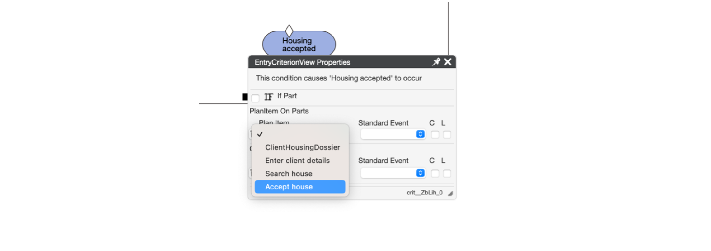
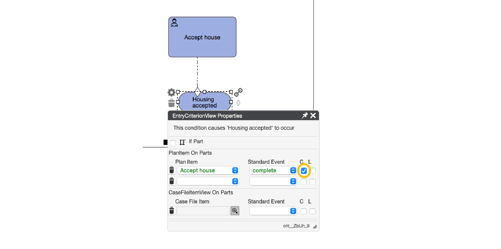
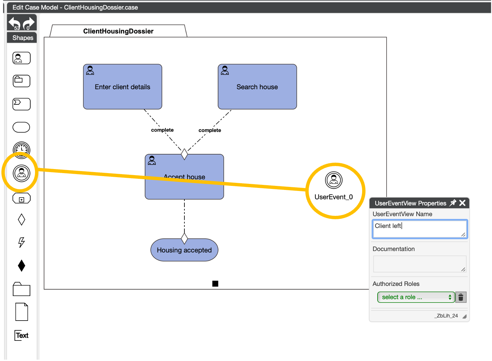
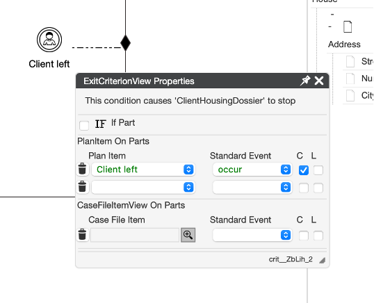
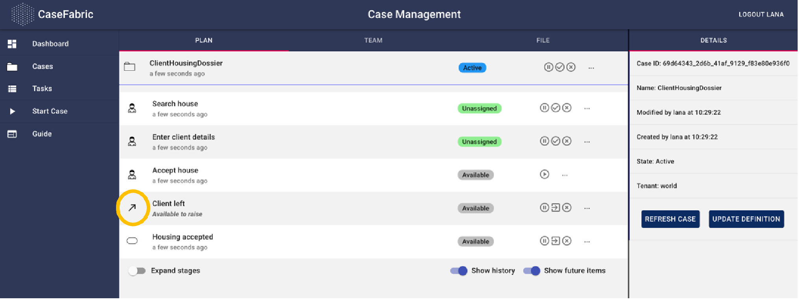

### Use Case Step
In the second part of the training, we will learn how to create dependencies in the case diagram.
There are three global steps as part of the case that need to be taken to complete the job.
 
1.	Collect and register the client's base data 
2.	The search for housing for client 
3.	The housing is accepted 

We completed the first 2 steps in part 1 of the training.
Let’s investigate step 3.

## Step 1: Accept the housing

### Solution support step
We need a task for the client to accept the house we have found.
The task to accept the house can also be rejected by the client.
We can express the fact that housing is accepted through a Milestone that indicates the acceptance. 

Now deploy and restart the case.

We see that the housing is already accepted (the milestone is completed), even though the task to accept the house has not been completed. Even more than that, we have not entered any client details and also have not completed the task to search a house. That is because there is no dependency modeled yet between the milestone and the task.

## Step 2: EntryCriterion

### Solution support step
We can modify our diagram to add dependencies.
This is done through criteria. As mentioned in part 1-step 3, under the Stage construct in the shapebox we find the Criteria. We have 3 types of criteria. For now we will focus on the EntryCriterion.

An entry criterion expresses a condition under which a task or stage is started, or a milestone is achieved. The task does not become active, unless the criterion is met. Similarly, a milestone is not achieved, unless the criterion is met.
Let’s draw an entry criterion on the milestone, by dragging it from the ShapeBox onto the Milestone

We see the properties of the Entry Criterion pop up. There is a lot of technical detail in here, but for now we can suffice with opening the Plan Item dropdown and selecting the “Accept house” task. 

By selecting the task, it automatically fills also the field “standard event”. 
We can also select the “C” checkbox. This will add a line in the diagram that makes the dependency more visual.

Let’s deploy and start the case.

We see that the “Housing accepted” milestone is grayed out and only “Available” (which basically means it is pending).
If we complete the task to accept the housing, we see that the milestone has been “Completed” which means that it has been achieved.

Note that still the tasks to enter client details and search the house have not been completed.
For those, we can also add similar dependencies.

Deploy and start the case.

Now we see that not only the milestone is not yet achieved, also the task Accept house is not active yet.
If we complete client details and complete the house search in the task list (the check), the task to accept the house becomes active. 

## CaseFabric CMMN explanation: 
***In principle, all tasks (and other constructs) run independently, and parallel in a case. It is not a sequential setup such as one tasks automatically triggers another. In fact, it is the other way around: a task is ‘waiting’ on a certain situation (‘event’) to occur, before it will start. We do have to define though what the situations, events are that will trigger the task to become active. That is why we started modeling the dependencies by starting at the end, the milestone.***

## Chapter 2b: Exit Dependencies

### Use Case Step
Sometimes a client reaches out to Civix and does not want to continue working with us.
We can achieve this in a simple manner by adding a User Event instead of a task. User Events are mechanism to quickly achieve a step without having to go through the task lifecycle of claiming, completing, etc.

When a client decides to discontinue working with us, we can simply end the case.
This can be done by adding an Exit Criterion on the case plan and selecting the User Event “Client left”.

### Solution support step
Select the User Event and name it “Client left”.

Now we can add the exit criterion to the ‘ClientHousingDossier’ that will end the case if the client decides to leave.

If we deploy and start a new case, we see that the new user event becomes visible in the case.

We can trigger the event by clicking the arrow to the left of it.

Note that when we click the button, the entire screen seems to become red, as if it is in error mode.
No such thing is the case. The case is terminated instead of completed, because we decided to stop it, even though it was only halfway.
Note: it is apparently not necessary to complete a case in the system. It does not mean we did not do our job, it just means that the case has not reached its regular outcome.

Let’s see how this behaves if we have already entered the client details and are in the middle of our house search.
Start a new case and complete the task to enter the client details.
Then trigger the user event about the fact that the client left.

We see that even though most of the case is terminated, the fact that we entered the client details is still registered as “Completed’.
Similarly, let’s start a case and also complete the task to search the house.

## Chapter 2c: Stages

Let’s now instead of leaving add a new User Event for the client to reject the house we found.

Add a milestone with house rejected.

Now we need to add the entry criterion for the milestone.

Now let's put all the tasks and milestones that have to do with accepting or rejecting the house into a group, or 'stage'. We can call the stage: acceptance.

## What is a stage?:
***In CMMN, a Stage provides a means to group plan items within the context of a case. A stage serves as building block for Case. A Stage contains plan items and sentries. Stages bundle other plan items. When creating our case models, sometimes we have plan items that are closely related and need to be grouped together. These items could be multiple tasks that must be completed before the case can proceed.***

***In the CaseFabric IDE, you can drag the Stage icon to the canvas and model its properties using the Properties Palette.***

For now the client can only accept the house if the search has been done and the house is offered to the client. The entry criterion is only linked to accepting the house. It should also be linked to rejecting the house. To make this process easy we can add an entry criterion to the entire 'acceptance' stage. This will make sure that all tasks in the stage will only be opened if the entry criterion is met.

Let’s delete the entry criterion that is linked to the human task ‘accept house’.

Now we can add the new entry criterion to the stage. We want the client data to be complete and the search for a house to be completed.

The last step is to add the exit criterion that if the house is rejected then the stage is 'done'.

The model now looks like this:

Let’s deploy and start the case.

When we complete the ‘enter client details’ task and ‘search house’ task, the stage becomes active.

Within the stage we can now reject the housing. We can expand the acceptance stage to see the tasks within the stage.

***When we reject the proposed house, we see that the case is completed, done!***
***The technical reason for this, is that there are no other activities available within the case model.***
***However, the search for a house is not yet completed. We can conclude that the current model does not support starting another search and needs more effort. This will be done in a later training section.***

