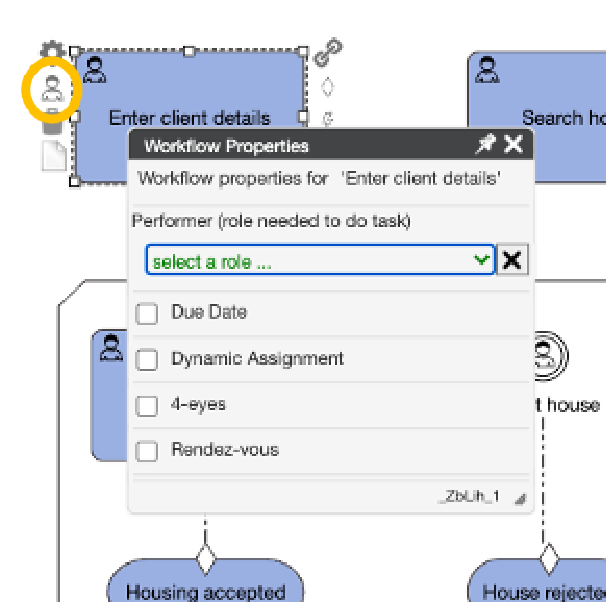
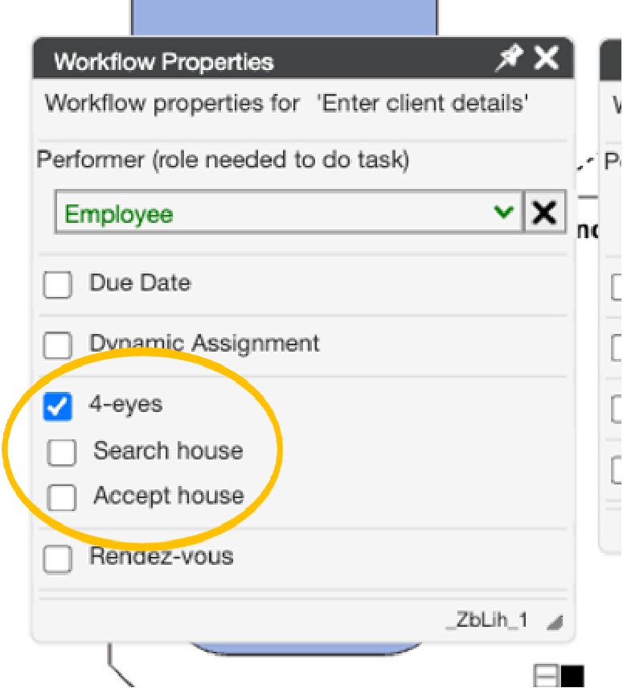
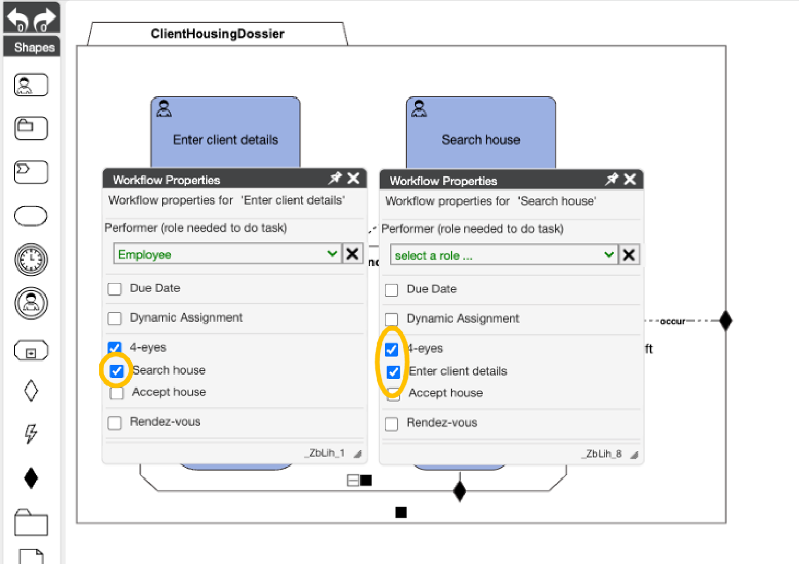

### Use Case Step
Until now, we have tested our model with a single user. However, searching the house is obviously done by someone from the Civix organization. Taking the decision on acceptance of the proposed house must be done by the client.
In general, we see that most cases are worked on by a group of people collaborating to complete the case. This group of people is referred to as the Case Team.
Every case instance has its own case team. This means, that for each house search we should also assign the team of people that will work on the case.

## Step 1: Filling the case team

### Solution support step
Add multiple users to a case

Start a new case, and then click on the “Team” tab

In this tab, we see all the users that are in the team that work on this case. This is only Lana.

Suppose we want to also give access to our colleague Hank. He can help Lana to divide the workload.
Let’s first logout as Lana and login as Hank, with username “hank” and password “hank”.

We see that Hank has no cases. The reason for this, is that Lana did not add Hank to any of the cases yet.

Let’s add Hank to a case. 
For this we need to login again as Lana, start a new case and navigate to the Team tab.
In the “Case team users” section, we see a drop down where we can add Hank to the team, and press the Submit button

If this is completed, we can login again as Hank, and now we see the case as well.

### Use Case Step
We have seen that we can add multiple users to the Case Team. Now we need to add roles to the users in the team. Not all users can do all tasks. Civix employees enter the client details and search a house, but the client has the task to accept the house. 

## Step 2: Defining Case roles

### Solution support step
Defining the different responsibilities in a case can be done by setting up Case Roles.

Open the case model and go to the Case Team halo.

Add a role named Employee, and a role named Client.

Deploy the case and update the definition of the existing case instance. The case then understands the new roles that are defined.

## Step 3: Assigning Case roles

### Solution support step
Assign a role to a user in the CaseTeam.

Let’s assign the Employee role to both Lana and Hank (note: this can only be done by Lana as she is the case owner. So you should be logged in as Lana). Go to the Case Team tab, add the role Employee to both Lana and Hank, and press the submit button. Note that the role names are case sensitive.

We can also make the client part of the case team. Let’s assume suzy is the client. So we will add Suzy to the case team, with the Client role. Then press the submit button.

## Step 4: Applying Case roles in Tasks

### Solution support step
Setting the HumanTask Performer role.

In the case model, we can now start using the case roles to determine task authorizations.
Go to the workflow properties of the task “Enter client details”.

In the dropdown of the Performer property, we can now select the role “Employee”. By doing this, we ensure that the task can only be done by users in the team that have this role.

We can do the same for the other tasks in the case model. Add the role Employee also to the task “Search house”, and the role Client to the task “Accept house”.

 

## Chapter 3b: 4-eyes principle 

### Use Case Step 
In some situations, two different tasks must be done by different users – even if they have the same role within the case. This is referred to as the 4 eyes principle. It takes 4 eyes to complete the work. In our example, we will simply say that the Employee that enters the client details cannot also search for the house. 

## Step 1: Defining 4 eyes on tasks

### Solution support step: 
Define 4-eyes on the combination of “Enter client details” and “Search house”.

Open the workflow properties of both tasks. If the popups overlap, you can move the popups a bit to show them next to each other.

On the task “Enter client details”, check the 4-eyes box. This will show a list of other tasks in the model that you can select.

Select the task “Search house” as 4-eyes with this task.
When you do this, you will see that at the same time, 4-eyes got enabled on the task “Search house”, and automatically the ”Enter client details” task was selected.

Try to run the case and play with how the 4-eyes principle works. 