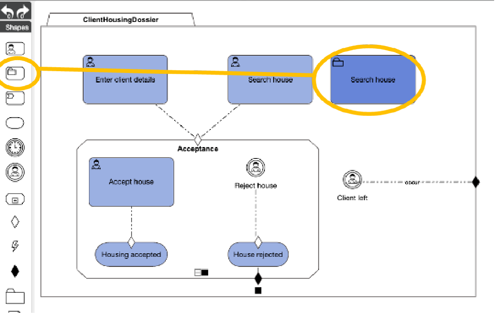
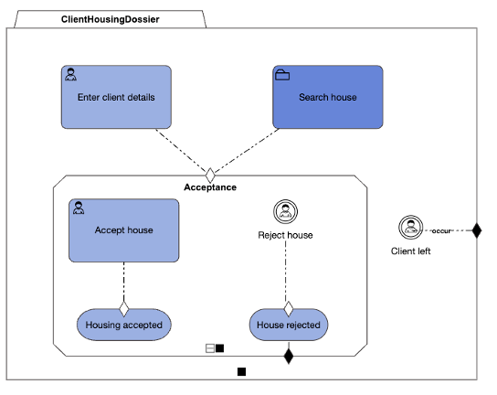

## Use Case Step
Searching the house can be a complex and time-consuming task. Until now, the tasks that we have added to our model are “simple” in nature. They are typically represented by a single screen and also are performed by a single user.
Searching the house can also be done by multiple people in parallel. Someone scanning websites, and someone else calling real-estate agents.
Nevertheless, the client has asked Civix to “search a house”. At the perspective of the top-level case, this is a task. We can express this in CaseFabric by defining a CaseTask (rather than a HumanTask).

In our example, we can add a shape of type CaseTask from the ShapeBox to the diagram. 
Let’s do that and call it “Search House” as well. 

We can now delete the HumanTask ”Search house” (and link the sub case to the entry criterion of the 
Acceptance stage).

## CaseFabric CMMN explanation 
***From a top level, the flow is the same as before, and the complexity of searching the house can be done in the definition of the CaseTask, which is a new case model in itself.***

***Note that this supports stepwise extension of building the solution.***

